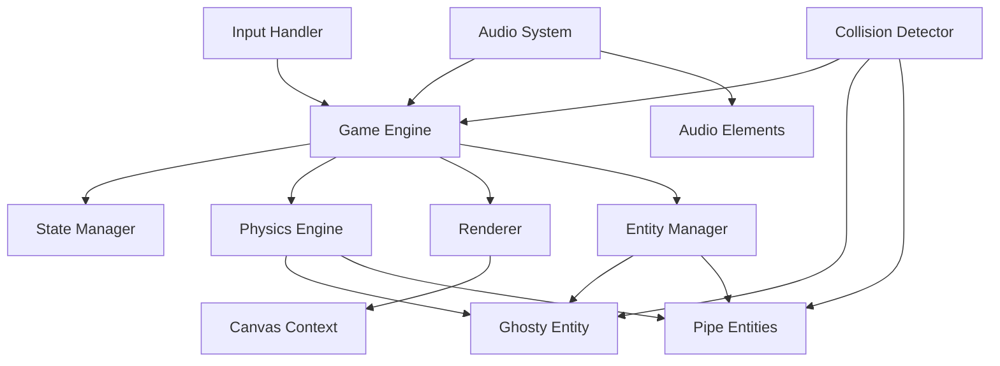
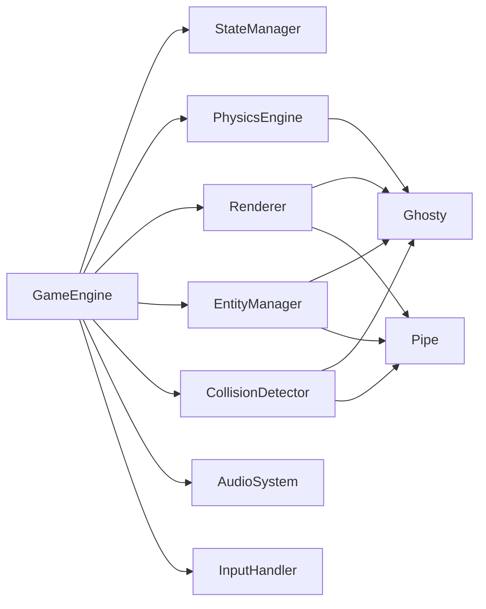

# Design Document

## Overview

Flappy Kiro is a browser-based endless scroller game built with vanilla JavaScript and HTML5 Canvas. The game implements classic Flappy Bird mechanics where players control a ghost character (Ghosty) navigating through randomly generated pipe obstacles using simple one-button controls.

### Core Game Loop

The game operates on a fixed 60 FPS game loop using `requestAnimationFrame`. Each frame:
1. Processes user input (click, spacebar, touch)
2. Updates game state based on current mode (menu, playing, game over)
3. Applies physics to Ghosty (gravity, velocity, position)
4. Spawns and moves pipes
5. Detects collisions
6. Updates score
7. Renders all visual elements
8. Plays audio feedback

### Key Design Decisions

**Pure JavaScript Implementation**: No external game frameworks to keep the codebase lightweight and maintain full control over rendering and physics.

**Component-Based Architecture**: Separate modules for game engine, input handling, collision detection, audio, and rendering to ensure maintainability and testability.

**Fixed Physics Time Step**: 60 FPS game loop with consistent physics calculations ensures predictable gameplay across different devices.

**Bounding Box Collision**: Simple AABB (Axis-Aligned Bounding Box) collision detection provides accurate results for rectangular game entities.

**Responsive Scaling**: All game elements scale proportionally based on canvas width to support various screen sizes while maintaining 9:16 aspect ratio.

## Architecture

### System Components



### Component Responsibilities

**Game Engine**
- Manages the main game loop via `requestAnimationFrame`
- Coordinates all subsystems (input, physics, collision, rendering, audio)
- Maintains frame timing and ensures 60 FPS operation
- Handles state transitions between menu, playing, and game over

**State Manager**
- Tracks current game state (menu, playing, game over)
- Manages state transitions and validation
- Exposes state query methods for other components

**Physics Engine**
- Applies gravitational acceleration (0.5 px/frame²)
- Updates entity velocities and positions
- Enforces velocity limits (upward: -10 px/frame, downward: 10 px/frame)
- Handles flap mechanics (instant velocity change to -8 px/frame)

**Entity Manager**
- Creates and destroys game entities (Ghosty, Pipes)
- Maintains entity collections
- Provides entity query methods

**Collision Detector**
- Performs AABB collision detection between Ghosty and pipes
- Checks boundary collisions (top/bottom of canvas)
- Reports collision events to Game Engine

**Input Handler**
- Listens for mouse clicks, touch events, and keyboard input
- Normalizes input events across devices
- Triggers appropriate actions based on current game state

**Renderer**
- Clears and redraws canvas each frame
- Renders background, pipes, Ghosty, score, and UI text
- Applies transformations (rotation) to Ghosty based on velocity
- Scales all visual elements proportionally

**Audio System**
- Loads audio assets (jump.wav, game_over.wav)
- Plays sound effects on game events
- Handles audio errors gracefully without interrupting gameplay

## Components and Interfaces

### Core Modules

#### GameEngine

```javascript
class GameEngine {
  constructor(canvas)
  init(): Promise<void>
  start(): void
  stop(): void
  reset(): void
  update(deltaTime: number): void
  render(): void
  handleInput(inputType: InputType): void
  getState(): GameState
  getScore(): number
}
```

**Responsibilities:**
- Initialize all subsystems
- Run the game loop
- Coordinate component interactions
- Manage game lifecycle

#### StateManager

```javascript
class StateManager {
  constructor()
  getCurrentState(): GameState
  transitionTo(newState: GameState): void
  isPlaying(): boolean
  isGameOver(): boolean
  isMenu(): boolean
}

enum GameState {
  MENU = 'menu',
  PLAYING = 'playing',
  GAME_OVER = 'game_over'
}
```

#### PhysicsEngine

```javascript
class PhysicsEngine {
  constructor(config: PhysicsConfig)
  applyGravity(entity: Entity, deltaTime: number): void
  updatePosition(entity: Entity, deltaTime: number): void
  applyFlap(entity: Entity): void
  clampVelocity(entity: Entity): void
}

interface PhysicsConfig {
  gravity: number          // 0.5 px/frame²
  flapVelocity: number    // -8 px/frame
  maxUpwardVelocity: number  // -10 px/frame
  maxDownwardVelocity: number // 10 px/frame
}
```

#### Entity System

```javascript
class Entity {
  x: number
  y: number
  width: number
  height: number
  velocityY: number
  
  getBoundingBox(): BoundingBox
  update(deltaTime: number): void
  render(ctx: CanvasRenderingContext2D): void
}

class Ghosty extends Entity {
  sprite: HTMLImageElement
  rotation: number
  
  applyFlap(): void
  updateRotation(): void
}

class Pipe extends Entity {
  gapY: number
  gapHeight: number
  scored: boolean
  
  getTopSegment(): BoundingBox
  getBottomSegment(): BoundingBox
  isOffScreen(canvasWidth: number): boolean
}

interface BoundingBox {
  x: number
  y: number
  width: number
  height: number
}
```

#### CollisionDetector

```javascript
class CollisionDetector {
  constructor(canvasHeight: number)
  
  checkGhostyPipeCollision(ghosty: Ghosty, pipe: Pipe): boolean
  checkGhostyBoundaryCollision(ghosty: Ghosty): boolean
  checkAABBCollision(box1: BoundingBox, box2: BoundingBox): boolean
  isGhostyInGap(ghosty: Ghosty, pipe: Pipe): boolean
}
```

**Collision Algorithm:**
1. Get Ghosty's bounding box
2. For each pipe:
   - Get top segment bounding box
   - Get bottom segment bounding box
   - Check AABB collision with top segment
   - Check AABB collision with bottom segment
   - If collision detected, return true
3. Check if Ghosty's y < 0 (top boundary)
4. Check if Ghosty's y + height > canvas height (bottom boundary)
5. Return collision result

#### InputHandler

```javascript
class InputHandler {
  constructor(canvas: HTMLCanvasElement)
  
  onInput(callback: (inputType: InputType) => void): void
  enable(): void
  disable(): void
}

enum InputType {
  CLICK = 'click',
  SPACEBAR = 'spacebar',
  TOUCH = 'touch'
}
```

**Input Events:**
- Mouse: `click` event on canvas
- Keyboard: `keydown` event for spacebar (key code 32)
- Touch: `touchstart` event on canvas

#### Renderer

```javascript
class Renderer {
  constructor(canvas: HTMLCanvasElement, scaleFactor: number)
  
  clear(): void
  renderBackground(): void
  renderPipe(pipe: Pipe): void
  renderGhosty(ghosty: Ghosty): void
  renderScore(score: number): void
  renderText(text: string, position: TextPosition): void
  setScaleFactor(scaleFactor: number): void
}

enum TextPosition {
  TOP_CENTER = 'top_center',
  MIDDLE_CENTER = 'middle_center',
  BOTTOM_CENTER = 'bottom_center'
}
```

**Rendering Order:**
1. Background (#87CEEB)
2. All pipes (#4CAF50)
3. Ghosty (with rotation)
4. Score text
5. State-specific instructions

#### AudioSystem

```javascript
class AudioSystem {
  constructor()
  
  async load(): Promise<void>
  playJump(): void
  playGameOver(): void
  handleError(error: Error, assetName: string): void
}
```

**Audio Loading:**
- Preload jump.wav and game_over.wav on initialization
- Set 5-second timeout for each asset load
- Log errors but continue initialization if loading fails
- Clone audio elements to allow concurrent playback

#### EntityManager

```javascript
class EntityManager {
  constructor(canvas: HTMLCanvasElement, scaleFactor: number)
  
  createGhosty(): Ghosty
  spawnPipe(): Pipe
  updatePipes(deltaTime: number): void
  removePipe(pipe: Pipe): void
  getPipes(): Pipe[]
  shouldSpawnPipe(): boolean
  reset(): void
}
```

**Pipe Spawning Logic:**
- Spawn new pipe every 90 frames (1.5 seconds at 60 FPS)
- Position right edge at canvas right edge
- Randomize gap center Y between 150px and (canvas height - 150px)
- Set gap height to 150px
- Remove pipes when completely off left edge

### Module Dependencies



## Data Models

### Game State

```javascript
interface GameData {
  state: GameState           // Current game state
  score: number             // Current score
  frameCount: number        // Total frames since game start
  lastPipeSpawn: number     // Frame number of last pipe spawn
}
```

### Entity Data

```javascript
interface GhostyData {
  x: number                 // Horizontal position (fixed at 50px)
  y: number                 // Vertical position
  width: number             // Sprite width (scaled)
  height: number            // Sprite height (scaled)
  velocityY: number         // Vertical velocity (px/frame)
  rotation: number          // Rotation angle (degrees)
  sprite: HTMLImageElement  // Loaded ghosty.png
}

interface PipeData {
  x: number                 // Horizontal position
  y: number                 // Not used (pipes extend full height)
  width: number             // Pipe width (scaled, ~60px baseline)
  height: number            // Canvas height
  gapY: number              // Gap center Y coordinate
  gapHeight: number         // Gap height (150px scaled)
  scored: boolean           // Whether this pipe has been scored
}
```

### Configuration Data

```javascript
interface GameConfig {
  // Physics constants
  gravity: number                    // 0.5 px/frame²
  flapVelocity: number              // -8 px/frame
  maxUpwardVelocity: number         // -10 px/frame
  maxDownwardVelocity: number       // 10 px/frame
  
  // Gameplay constants
  pipeSpawnInterval: number         // 90 frames
  pipeSpeed: number                 // 2 px/frame
  gapHeight: number                 // 150px
  minGapY: number                   // 150px
  maxGapYOffset: number             // 150px
  
  // Visual constants
  baseCanvasWidth: number           // 400px (baseline for scaling)
  aspectRatio: number               // 9:16
  backgroundColor: string           // '#87CEEB'
  pipeColor: string                 // '#4CAF50'
  
  // Asset paths
  ghostySpritePath: string          // 'assets/ghosty.png'
  jumpSoundPath: string             // 'assets/jump.wav'
  gameOverSoundPath: string         // 'assets/game_over.wav'
}
```

### Responsive Scaling

All game elements scale proportionally based on canvas width:

```javascript
scaleFactor = currentCanvasWidth / baseCanvasWidth // base = 400px

scaledGhostyWidth = nativeSpriteWidth * scaleFactor
scaledGhostyHeight = nativeSpriteHeight * scaleFactor
scaledPipeWidth = 60 * scaleFactor
scaledGapHeight = 150 * scaleFactor
scaledFontSize = 36 * scaleFactor
```

### Canvas Sizing Logic

```javascript
function calculateCanvasDimensions(viewportWidth, viewportHeight) {
  const targetAspectRatio = 9 / 16
  
  // Try fitting by width
  let width = viewportWidth
  let height = width / targetAspectRatio
  
  // If height exceeds viewport, fit by height instead
  if (height > viewportHeight) {
    height = viewportHeight
    width = height * targetAspectRatio
  }
  
  return { width, height }
}
```


## Correctness Properties

*A property is a characteristic or behavior that should hold true across all valid executions of a system—essentially, a formal statement about what the system should do. Properties serve as the bridge between human-readable specifications and machine-verifiable correctness guarantees.*

### Property 1: Gravity Application

*For any* initial vertical velocity, applying gravitational acceleration of 0.5 pixels per frame squared for N frames SHALL increase the velocity by exactly 0.5 * N pixels per frame.

**Validates: Requirements 1.4, 8.2**

### Property 2: Velocity Clamping

*For any* velocity value, the velocity clamping function SHALL ensure the result is within the range [-10, 10] pixels per frame, where values below -10 are clamped to -10 and values above 10 are clamped to 10.

**Validates: Requirements 1.8, 8.3**

### Property 3: Position Update

*For any* initial position and velocity, updating the position by adding the velocity SHALL result in a new position equal to the initial position plus the velocity value.

**Validates: Requirements 8.4**

### Property 4: Pipe Movement

*For any* initial pipe x-coordinate, moving the pipe at 2 pixels per frame for N frames SHALL result in the pipe's x-coordinate decreasing by exactly 2 * N pixels.

**Validates: Requirements 2.2**

### Property 5: Pipe Removal

*For any* pipe with x-coordinate plus pipe width less than 0, the pipe removal check SHALL return true indicating the pipe is off-screen and should be removed.

**Validates: Requirements 2.3**

### Property 6: Pipe Spawn Timing

*For any* frame count, if the frame count modulo 90 equals 0 and the frame count is greater than 0, the spawn check SHALL return true indicating a new pipe should be spawned.

**Validates: Requirements 2.1**

### Property 7: Gap Position Bounds

*For any* randomly generated gap center Y-coordinate, the value SHALL be within the range [150, canvasHeight - 150] pixels.

**Validates: Requirements 2.4**

### Property 8: Gap Height Invariant

*For any* pipe with a defined gap center Y-coordinate, the distance between the bottom edge of the top pipe segment (gapY - gapHeight/2) and the top edge of the bottom pipe segment (gapY + gapHeight/2) SHALL equal exactly 150 pixels (scaled).

**Validates: Requirements 2.5**

### Property 9: AABB Collision Detection

*For any* two axis-aligned bounding boxes where box1's right edge is greater than box2's left edge AND box1's left edge is less than box2's right edge AND box1's bottom edge is greater than box2's top edge AND box1's top edge is less than box2's bottom edge, the AABB collision function SHALL return true.

**Validates: Requirements 3.1, 3.2**

### Property 10: Gap Non-Collision

*For any* Ghosty position where Ghosty's bounding box is entirely within the gap space (Ghosty.y >= gapY - gapHeight/2 + Ghosty.height AND Ghosty.y <= gapY + gapHeight/2), the collision detection function SHALL return false for that pipe pair.

**Validates: Requirements 3.3**

### Property 11: Boundary Collision Detection

*For any* Ghosty position where y < 0 OR (y + height) > canvasHeight, the boundary collision function SHALL return true.

**Validates: Requirements 3.4, 3.5**

### Property 12: Score Detection

*For any* Ghosty x-coordinate and pipe right-edge x-coordinate where Ghosty's x is greater than the pipe's right edge, and the pipe is not already marked as scored, the scoring check SHALL mark the pipe as scored.

**Validates: Requirements 4.1**

### Property 13: Score Increment

*For any* current score value, when a pipe is marked as scored, the new score SHALL equal the previous score plus 1.

**Validates: Requirements 4.2**

### Property 14: Score Idempotence

*For any* pipe that is already marked as scored, subsequent scoring checks for that same pipe SHALL NOT increment the score, regardless of how many times the check is performed.

**Validates: Requirements 4.3**

### Property 15: Reset Removes All Pipes

*For any* game state containing N pipes (where N >= 0), triggering a reset SHALL result in a game state with 0 pipes.

**Validates: Requirements 5.8**

### Property 16: Audio Error Handling

*For any* audio loading or playback error, the game engine SHALL continue execution and the game state SHALL remain in its current state without transitioning to an error state.

**Validates: Requirements 6.8**

### Property 17: Rotation Calculation

*For any* velocity value, the rotation angle calculation SHALL return a value proportional to the velocity, where negative velocities produce counterclockwise rotation (up to -25 degrees) and positive velocities produce clockwise rotation (up to 90 degrees).

**Validates: Requirements 7.7, 7.8**

### Property 18: Color Contrast Ratio

*For any* foreground color and background color, the contrast ratio calculation SHALL return a value between 1 and 21, computed as (lighter + 0.05) / (darker + 0.05) where lighter and darker are the relative luminance values.

**Validates: Requirements 7.5**

### Property 19: Canvas Aspect Ratio

*For any* viewport dimensions (viewportWidth, viewportHeight), the calculated canvas dimensions SHALL maintain a 9:16 aspect ratio (canvasWidth / canvasHeight = 9/16) and fit entirely within the viewport (canvasWidth <= viewportWidth AND canvasHeight <= viewportHeight).

**Validates: Requirements 9.1, 9.2**

### Property 20: Proportional Element Scaling

*For any* canvas width, all game elements SHALL scale proportionally where scaledSize = baseSize * (canvasWidth / 400), ensuring consistent visual proportions across different canvas sizes.

**Validates: Requirements 9.4**

### Property 21: Resize State Preservation

*For any* game state (including current score, Ghosty position, Ghosty velocity, pipe positions, and game mode), triggering a canvas resize SHALL preserve all state values without modification.

**Validates: Requirements 9.5**

## Error Handling

### Physics Edge Cases

**Extreme Velocities**: The physics engine clamps velocities to prevent unrealistic movement:
- Upward velocity clamped at -10 px/frame (prevents excessive upward speed)
- Downward velocity clamped at 10 px/frame (terminal velocity)

**Position Boundaries**: Collision detection handles out-of-bounds positions:
- y < 0: Top boundary collision
- y + height > canvasHeight: Bottom boundary collision

### Asset Loading Errors

**Image Loading Failure**:
- Timeout: 10 seconds per asset
- Behavior: Display error message "Failed to load [asset name]. Please refresh to try again."
- Recovery: Prevent game start, show refresh instructions

**Audio Loading Failure**:
- Timeout: 5 seconds per asset
- Behavior: Log error to console, continue initialization without audio
- Recovery: Game proceeds silently, no audio playback

**Audio Playback Errors**:
- Decoding/playback failures logged to console
- Game continues without interruption
- No error messages displayed to player

### Input Edge Cases

**Rapid Input**: Multiple inputs within the same frame are handled by setting velocity to flap velocity (-8 px/frame) once per frame, preventing velocity stacking.

**Input During State Transitions**: Input handler checks current state before applying actions:
- Menu state: Input triggers transition to playing state
- Playing state: Input applies flap to Ghosty
- Game over state: Input triggers reset and transition to playing state

### Viewport Edge Cases

**Minimum Viewport Size**:
- Threshold: 320px width, 568px height
- Behavior: Display error "Screen too small. Minimum 320x568 required."
- Recovery: Prevent game start until viewport meets minimum

**Window Resize During Gameplay**:
- Recalculate canvas dimensions maintaining 9:16 aspect ratio
- Scale all game elements proportionally
- Preserve game state (score, positions, velocities, game mode)
- Continue gameplay without interruption

### Collision Edge Cases

**Ghosty at Gap Boundary**: Collision detection uses pixel-perfect AABB comparison:
- Even 1-pixel overlap with pipe triggers collision
- Ghosty entirely within gap produces no collision

**Multiple Simultaneous Collisions**: First detected collision triggers game over, subsequent collision checks are not performed.

### Score Edge Cases

**Pipe Already Scored**: Each pipe tracks its scored state. Once marked as scored, subsequent passes do not increment score (idempotent scoring).

**Score Display Overflow**: Score is an integer. For unrealistically high scores (> 999), text may overflow display area, but game continues functioning.

## Testing Strategy

### Dual Testing Approach

The testing strategy combines property-based testing for game logic and example-based testing for specific scenarios:

**Property-Based Tests**: Verify universal properties across randomized inputs
- Physics calculations (gravity, velocity, position)
- Collision detection algorithms (AABB, boundaries)
- Pipe generation and movement logic
- Score tracking and idempotence
- Canvas sizing and scaling calculations
- State preservation during resize

**Example-Based Unit Tests**: Verify specific scenarios and edge cases
- Initial state values (Ghosty position, score = 0, state = menu)
- State transitions (menu → playing → game over)
- Input handling (click, spacebar, touch events)
- Specific rendering configuration (colors, fonts)
- Error messages for specific failures

**Integration Tests**: Verify component interactions
- Full game loop execution
- Audio loading and playback (mocked)
- Canvas rendering (mocked or headless)
- Asset loading with network failures
- Cross-browser compatibility (Chrome 90+, Firefox 88+, Safari 14+, Edge 90+)

### Property-Based Testing Configuration

**Framework**: fast-check (JavaScript property-based testing library)

**Test Configuration**:
- Minimum 100 iterations per property test
- Each test references its design document property
- Tag format: `Feature: flappy-kiro, Property {number}: {property_text}`

**Example Property Test Structure**:
```javascript
// Feature: flappy-kiro, Property 1: Gravity Application
fc.assert(
  fc.property(
    fc.float({ min: -50, max: 50 }), // initial velocity
    fc.integer({ min: 1, max: 100 }), // frame count
    (initialVelocity, frameCount) => {
      const expectedVelocity = initialVelocity + (0.5 * frameCount);
      const actualVelocity = applyGravity(initialVelocity, frameCount);
      return Math.abs(actualVelocity - expectedVelocity) < 0.001;
    }
  ),
  { numRuns: 100 }
);
```

### Unit Test Coverage

**Physics Engine**:
- Gravity application (property test)
- Velocity clamping (property test)
- Position updates (property test)
- Flap application (example test: velocity = -8)

**Collision Detector**:
- AABB collision (property test with random boxes)
- Gap non-collision (property test)
- Boundary collision (property test)
- Edge case: 1-pixel overlap (example test)

**Entity Manager**:
- Pipe spawning (property test for timing)
- Pipe movement (property test)
- Pipe removal (property test)
- Gap generation bounds (property test)
- Gap height invariant (property test)
- Initial Ghosty position (example test)

**Score Tracking**:
- Score detection (property test)
- Score increment (property test)
- Score idempotence (property test)
- Initial score = 0 (example test)

**State Management**:
- Initial state = menu (example test)
- State transitions (example tests for each transition)
- Reset clears pipes (property test with N pipes)
- Reset initializes values (example test)

**Input Handler**:
- Click event handling (example test with mocked event)
- Spacebar handling (example test)
- Touch event handling (example test)
- State-dependent behavior (example tests)

**Canvas Sizing**:
- Aspect ratio maintenance (property test with random viewport sizes)
- Element scaling (property test)
- Minimum viewport check (example test at 320x568)
- Resize state preservation (property test)

**Rotation Calculation**:
- Velocity-based rotation (property test with random velocities)
- Upward rotation range (property test: -25° max)
- Downward rotation range (property test: 90° max)

**Audio System**:
- Load success (integration test with mocked fetch)
- Load timeout (example test with 5s delay)
- Playback error handling (example test)
- Game continues on error (property test with various errors)

**Renderer**:
- Color configuration (example tests: background, pipes)
- Contrast ratio calculation (property test with random colors)
- Rendering order (example test with spy/mock)

### Performance Testing

**Frame Rate**: 
- Integration test measuring FPS over 10-second gameplay period
- Target: >= 55 FPS for >= 95% of frames on 60 Hz displays

**Browser Compatibility**:
- Manual testing in Chrome 90+, Firefox 88+, Safari 14+, Edge 90+
- Verify Canvas API support
- Verify requestAnimationFrame behavior
- Verify audio playback support

### Test Organization

```
tests/
  unit/
    physics.test.js         # Property tests for physics
    collision.test.js       # Property tests for collision
    entities.test.js        # Property tests for pipes, Ghosty
    score.test.js           # Property tests for scoring
    state.test.js           # Example tests for state management
    input.test.js           # Example tests for input handling
    canvas.test.js          # Property tests for sizing/scaling
    rotation.test.js        # Property tests for rotation
    contrast.test.js        # Property tests for contrast ratio
  integration/
    game-loop.test.js       # Full game loop integration
    audio.test.js           # Audio loading and playback
    rendering.test.js       # Canvas rendering with mocks
    assets.test.js          # Asset loading with failures
  performance/
    fps.test.js             # Frame rate measurement
```

### Mocking Strategy

**Canvas API**: Use canvas-mock or jest-canvas-mock for unit tests
**Audio API**: Mock HTMLAudioElement for audio tests
**DOM Events**: Use Jest or Sinon to create mock events
**requestAnimationFrame**: Mock with controlled time advancement
**Asset Loading**: Mock Image and Audio element loading

